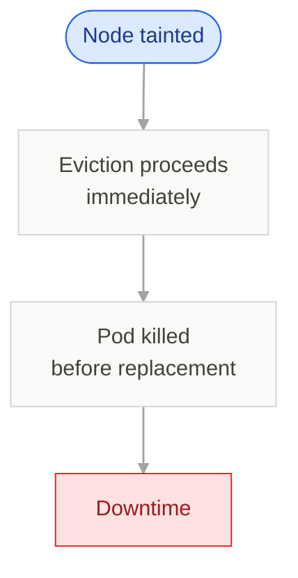
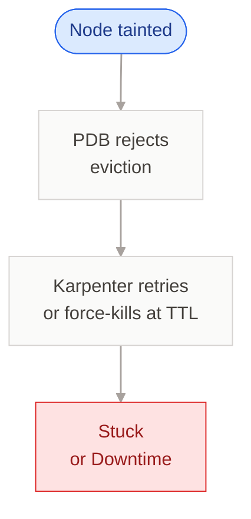
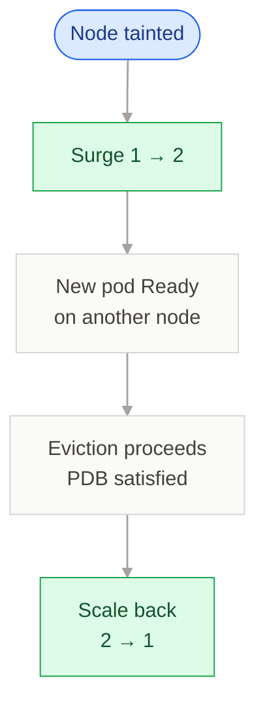

# k8s-drain-surge

<p align="center">
  <b>Zero-downtime node drains and restarts for single-replica Deployments and Argo Rollouts in Kubernetes.</b>
</p>

<p align="center">
  <a href="https://github.com/aeyrtonvs/k8s-drain-surge/actions/workflows/ci.yaml"></a>
  <a href="https://github.com/aeyrtonvs/k8s-drain-surge/releases/latest"></a>
  <a href="https://github.com/aeyrtonvs/k8s-drain-surge/pkgs/container/k8s-drain-surge"></a>
  
  
  <a href="LICENSE"></a>
  <a href="https://artifacthub.io/packages/search?repo=k8s-drain-surge"></a>
</p>

A Kubernetes controller that protects single-replica `Deployment`s and Argo `Rollout`s from downtime during disruptive events — node drains by Karpenter / Cluster Autoscaler / `kubectl drain`, and PDB-blocked Argo Rollout restarts. Two opt-in protections:

- **Drain-surge** (always on) — when a node is tainted for drain, temporarily scales opted-in workloads 1→2 replicas, waits for the new pod to be Ready on a different node, lets the eviction proceed, then scales back.
- **Restart-surge** (opt-in) — when an Argo Rollout's `restart` is stuck because Argo's PodRestarter uses the eviction API and a `minAvailable: 1` PDB rejects it indefinitely, surges 1→2 so the eviction can proceed, then scales back once Argo finishes. Argo Rollouts only — Deployments don't need this because `kubectl rollout restart deployment/...` uses delete (not eviction) and bypasses PDBs.

Supports **Argo Rollouts** (Canary and Blue-Green) and **Deployments**.

## Quick Start

```bash
helm install k8s-drain-surge oci://ghcr.io/aeyrtonvs/charts/k8s-drain-surge \
  --namespace kube-system
```

Then opt in any single-replica workload and pair it with a PDB:

```yaml
metadata:
  annotations:
    k8s-drain-surge.io/enabled: "true"
---
apiVersion: policy/v1
kind: PodDisruptionBudget
spec:
  minAvailable: 1
  selector: { matchLabels: { app: my-app } }
```

See [What you need to do](#what-you-need-to-do) for the full opt-in checklist (ArgoCD, HPA, Karpenter `terminationGracePeriod`).

## Features

- **Opt-in by annotation** — never touches a workload without `k8s-drain-surge.io/enabled: "true"`
- **Drain-surge** — pre-empts evictions from Karpenter, Cluster Autoscaler, and manual `kubectl drain`
- **Restart-surge** — unblocks PDB-stuck `kubectl argo rollouts restart` on single-replica Rollouts
- **HPA-aware** — patches `minReplicas` instead of `spec.replicas` when an HPA is attached; restores on completion
- **ArgoCD / FluxCD friendly** — detects external resets of `spec.replicas` mid-surge and re-applies (with `ignoreDifferences` documented)
- **Crash-safe** — every operation is annotation-driven and idempotent; a restarted controller resumes from on-disk state
- **Orphan recovery** — on leader election, aborts and restores any workload whose drain node is no longer tainted
- **Stale/timeout aborts** — bounded operation time; replicas always restored on overrun
- **Argo Rollouts + Deployments** — Canary, Blue-Green, and RollingUpdate strategies
- **Observable** — structured logs (Loki/Datadog-friendly key vocabulary) and Kubernetes Events at every user-visible decision

## Dependencies

- Kubernetes >= 1.28
- A PodDisruptionBudget per workload (required)
- One of the following node lifecycle managers (or manual drain):
  - [Karpenter](https://karpenter.sh/) >= 0.32
  - [Cluster Autoscaler](https://github.com/kubernetes/autoscaler)
  - Manual `kubectl drain` / `kubectl taint`
- [Argo Rollouts](https://argoproj.github.io/argo-rollouts/) >= 1.5 (only if using Rollout workloads)

## How it works

The controller watches for nodes with drain taints and runs a state machine per workload:

<table>
<tr>
<th width="33%" align="left">

<sub>SCENARIO&nbsp;1</sub><br/>
**No PDB**<br/>
<sub>Outcome — Downtime</sub>

</th>
<th width="33%" align="left">

<sub>SCENARIO&nbsp;2</sub><br/>
**PDB, no controller**<br/>
<sub>Outcome — Stuck / Downtime</sub>

</th>
<th width="33%" align="left">

<sub>SCENARIO&nbsp;3</sub><br/>
**PDB + k8s-drain-surge**<br/>
<sub>Outcome — Zero downtime</sub>

</th>
</tr>
<tr><td valign="top">



</td><td valign="top">



</td><td valign="top">



</td></tr>
</table>

The controller is **opt-in only**. It will not touch any workload unless you explicitly annotate it.

## Restart-surge (opt-in)

Argo Rollouts' `restart` is implemented in-place: it evicts existing pods via the eviction API (no new ReplicaSet, no template change). With one replica and a `minAvailable: 1` PDB, every eviction attempt fails with 429 and Argo retries every ~30 seconds forever. The Rollout sits in `Progressing` with `message: rollout is restarting`, but the pod is never replaced.

When you enable `--restart-surge-enabled=true` (or `controller.restartSurge.enabled=true` in the Helm chart), the controller:

```
1. Sees spec.restartAt set, status.restartedAt not caught up, and an old pod still present
2. Waits a grace period (default 60s) in case Argo finishes on its own
3. Scales the workload 1 -> 2 (or patches HPA minReplicas)
4. Waits for the surge pod to be Ready
5. With 2 pods Ready, the PDB now permits Argo's PodRestarter to evict the old one
6. Once Argo reports completion (status.restartedAt == spec.restartAt), scales back to 1
```

Uses the same `k8s-drain-surge.io/enabled: "true"` opt-in annotation as drain-surge. Same PDB requirement.

## What you need to do

For each workload you want protected:

### 1. Add the opt-in annotation

```yaml
metadata:
  annotations:
    k8s-drain-surge.io/enabled: "true"
```

### 2. Create a PodDisruptionBudget

The PDB is what blocks Karpenter from killing the pod before the surge is ready. Without it, the controller skips the workload.

```yaml
apiVersion: policy/v1
kind: PodDisruptionBudget
metadata:
  name: my-app-pdb
spec:
  minAvailable: 1
  selector:
    matchLabels:
      app: my-app
```

### 3. Deployment strategy (Deployments only)

Deployments must use `RollingUpdate`. The controller skips `Recreate` strategy.

```yaml
spec:
  strategy:
    type: RollingUpdate
    rollingUpdate:
      maxSurge: 1
      maxUnavailable: 0
```

### 4. ArgoCD / FluxCD users

If your workloads are managed by ArgoCD, add `ignoreDifferences` so ArgoCD does not reset `spec.replicas` during the surge:

```yaml
apiVersion: argoproj.io/v1alpha1
kind: Application
spec:
  ignoreDifferences:
    - group: argoproj.io
      kind: Rollout
      jsonPointers:
        - /spec/replicas
    - group: apps
      kind: Deployment
      jsonPointers:
        - /spec/replicas
  syncPolicy:
    syncOptions:
      - RespectIgnoreDifferences=true
```

### 5. Karpenter NodePool (if applicable)

If your NodePool has `terminationGracePeriod` configured, it must be **greater** than the controller's `--readiness-timeout` (default 10m). Without `terminationGracePeriod`, Karpenter waits indefinitely (which is the ideal behavior).

## Installation

### Helm CLI

```bash
helm install k8s-drain-surge oci://ghcr.io/aeyrtonvs/charts/k8s-drain-surge \
  --version <VERSION> \
  --namespace kube-system
```

Or from the repo source:

```bash
helm install k8s-drain-surge deploy/helm/k8s-drain-surge \
  --namespace kube-system
```

### Verifying signatures

Release artifacts (controller image and Helm chart) are signed with [cosign](https://docs.sigstore.dev/) using GitHub Actions OIDC keyless signing. To verify before installing:

```bash
# Image
cosign verify ghcr.io/aeyrtonvs/k8s-drain-surge:<VERSION> \
  --certificate-identity-regexp="^https://github.com/aeyrtonvs/k8s-drain-surge/\.github/workflows/release\.yaml@refs/tags/release/.*$" \
  --certificate-oidc-issuer=https://token.actions.githubusercontent.com

# Chart
cosign verify ghcr.io/aeyrtonvs/charts/k8s-drain-surge:<VERSION> \
  --certificate-identity-regexp="^https://github.com/aeyrtonvs/k8s-drain-surge/\.github/workflows/release\.yaml@refs/tags/release/.*$" \
  --certificate-oidc-issuer=https://token.actions.githubusercontent.com
```

A successful verification prints the certificate's claims (workflow name, ref, commit SHA) — confirming the artifact was built by the official `release.yaml` workflow in this repo and not tampered with after publish.

### Terraform

```hcl
resource "helm_release" "k8s_drain_surge" {
  name       = "k8s-drain-surge"
  namespace  = "kube-system"
  repository = "oci://ghcr.io/aeyrtonvs/charts"
  chart      = "k8s-drain-surge"
  version    = "<VERSION>"

  set {
    name  = "controller.readinessTimeout"
    value = "10m"
  }

  set {
    name  = "controller.requeueInterval"
    value = "5s"
  }
}
```

## Development

### Devcontainer (recommended)

The repo ships a [Dev Container](https://containers.dev/) so the whole toolchain (Go 1.22, `make`, dependencies) is reproducible and matches CI exactly. You don't need Go installed on the host.

Requirements: VS Code with the [Dev Containers](https://marketplace.visualstudio.com/items?itemName=ms-vscode-remote.remote-containers) extension (or any editor that supports the devcontainer spec), and Docker.

Setup:

1. Open the project in VS Code.
2. `Cmd+Shift+P` → **Dev Containers: Reopen in Container**.
3. First open builds the image (`golang:1.22-bookworm`) and runs `.devcontainer/bootstrap.sh`, which executes the same `make` targets CI runs: `go mod download`, `make tidy`, `make vet`, `make test`, `make build`. Takes a few minutes the first time; subsequent opens are instant.

What's persisted across rebuilds:

- `/go/pkg/mod` (module cache) and `/root/.cache/go-build` (build cache) are mounted on named Docker volumes (`k8s-drain-surge-gomodcache`, `k8s-drain-surge-gobuildcache`), so `go test` and `go build` stay warm.
- If a cache ever gets corrupted: `docker volume rm k8s-drain-surge-gomodcache k8s-drain-surge-gobuildcache` and rebuild.

Inside the container, all `make` targets work directly. CI parity is the contract — anything green in the devcontainer is green in CI. If bootstrap fails (e.g. a broken test on `master`), you still get a shell — fix it and re-run `bash .devcontainer/bootstrap.sh`.

### Make targets

| Command | Description |
|---|---|
| `make build` | Compile the controller binary to `bin/controller` |
| `make test` | Run all tests with race detector |
| `make vet` | Run `go vet` |
| `make fmt` | Run `go fmt` |
| `make tidy` | Run `go mod tidy` |
| `make docker-build` | Build the Docker image locally |
| `make helm-package` | Package the Helm chart to `bin/` |

## Configuration

All configuration is done through the Helm `values.yaml`:

| Value | Default | Description |
|---|---|---|
| `replicaCount` | `2` | Controller replicas (HA with leader election) |
| `controller.readinessTimeout` | `10m` | Timeout waiting for new pod readiness |
| `controller.requeueInterval` | `5s` | Poll interval between state checks |
| `controller.leaderElect` | `true` | Enable leader election |
| `controller.metricsPort` | `8080` | Prometheus metrics port |
| `controller.healthPort` | `8081` | Health/readiness probe port |
| `controller.restartSurge.enabled` | `false` | Enable restart-surge protection (Argo Rollouts only) |
| `controller.restartSurge.gracePeriod` | `60s` | Wait this long after `spec.restartAt` before surging (lets Argo finish unaided when PDB permits) |
| `controller.restartSurge.timeout` | `10m` | Total budget for one restart-surge operation |
| `priorityClassName` | `system-cluster-critical` | Pod priority class |
| `nodeSelector` | `kubernetes.io/os: linux` | Node selector for controller pods |

For Windows workloads that take longer to start, increase the timeout:

```bash
helm install k8s-drain-surge oci://ghcr.io/aeyrtonvs/charts/k8s-drain-surge \
  --namespace kube-system \
  --set controller.readinessTimeout=15m
```

## Full example: Deployment

```yaml
apiVersion: apps/v1
kind: Deployment
metadata:
  name: my-app
  annotations:
    k8s-drain-surge.io/enabled: "true"
spec:
  replicas: 1
  strategy:
    type: RollingUpdate
    rollingUpdate:
      maxSurge: 1
      maxUnavailable: 0
  selector:
    matchLabels:
      app: my-app
  template:
    metadata:
      labels:
        app: my-app
    spec:
      containers:
        - name: my-app
          image: my-app:latest
          ports:
            - containerPort: 8080
          readinessProbe:
            httpGet:
              path: /health
              port: 8080
---
apiVersion: policy/v1
kind: PodDisruptionBudget
metadata:
  name: my-app-pdb
spec:
  minAvailable: 1
  selector:
    matchLabels:
      app: my-app
```

## Full example: Argo Rollout

```yaml
apiVersion: argoproj.io/v1alpha1
kind: Rollout
metadata:
  name: my-app
  annotations:
    k8s-drain-surge.io/enabled: "true"
spec:
  replicas: 1
  selector:
    matchLabels:
      app: my-app
  template:
    metadata:
      labels:
        app: my-app
    spec:
      containers:
        - name: my-app
          image: my-app:latest
  strategy:
    canary:
      steps:
        - setWeight: 20
        - pause: { duration: 30s }
---
apiVersion: policy/v1
kind: PodDisruptionBudget
metadata:
  name: my-app-pdb
spec:
  minAvailable: 1
  selector:
    matchLabels:
      app: my-app
```

## Troubleshooting

| Symptom | Cause | Fix |
|---|---|---|
| Controller skips workload | Missing `k8s-drain-surge.io/enabled: "true"` annotation | Add the annotation |
| "no matching PDB" in logs | No PDB with matching selector | Create a PDB with `minAvailable: 1` |
| "not stable" in logs | Workload is mid-rollout | Wait for rollout to complete |
| "strategy does not support surge" | Deployment uses `Recreate` strategy | Change to `RollingUpdate` |
| "HPA maxReplicas=1" | HPA prevents scaling above 1 | Set `maxReplicas >= 2` or remove HPA |
| Replicas stuck at 2 | Controller crashed mid-operation | Restarts recover automatically; manual fix below |
| Timeout on Windows pods | Windows nodes take 12-17min to start | Set `--readiness-timeout 15m` or higher |
| Short-lived extra pod appears during scale-down | ReplicaSet controller observes `desired=2` briefly while the old pod terminates and creates a replacement; deleted on the next reconcile when replicas are patched back | Expected. Scaling down before the old pod terminates would risk deleting the surge pod instead. |
| `kubectl argo rollouts restart` on single-replica Rollout hangs forever | Argo's PodRestarter uses eviction API; PDB `minAvailable: 1` rejects every attempt | Enable restart-surge (`--restart-surge-enabled=true`), or unblock manually by clearing `spec.restartAt` and changing `spec.template` instead |

Manual cleanup if replicas are stuck:

```bash
kubectl annotate deployment my-app \
  k8s-drain-surge.io/drain-state- \
  k8s-drain-surge.io/original-replicas- \
  k8s-drain-surge.io/drain-node- \
  k8s-drain-surge.io/drain-start-
kubectl scale deployment my-app --replicas=1
```

## Support

Found a bug, hit a rough edge, or have a question? Two ways to get in touch:

- **GitHub Issues** — [open an issue](https://github.com/aeyrtonvs/k8s-drain-surge/issues/new) (preferred, so the discussion stays public and searchable).
- **Email** — [aeyrtonvs@gmail.com](mailto:aeyrtonvs@gmail.com) for private reports (e.g. suspected security issues).

## License

See [LICENSE](LICENSE).
